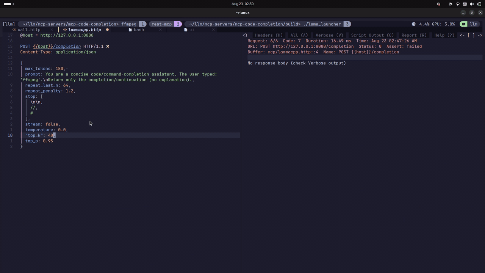

# grepjson

A command-line tool to search for JSON keys matching a given pattern with optional fuzzy matching based on Levenshtein distance.


## Demo


## Installation

To install `grepjson`, run the following command:


## 📦 Installation

### Quick Install (Linux/macOS)
Run this one-line command:

```bash
curl -sSL https://raw.githubusercontent.com/shoneyJ/grepjson/master/install.sh | bash
```

## Usage

### Basic Usage

To search for JSON keys matching a specific pattern, use the `-pattern` flag:

```sh
grepjson -pattern "example" < input.json
```

This will output the matches in JSON format to standard output.
# Improving JSON Search in Neovim with grepjson

While working with large NoSQL/Elasticsearch documents in my Neovim editor using the [**kulala** REST client](https://neovim.getkulala.net) REST client, I found its built-in [`jq`](https://jqlang.org) (jqlang) filtering limiting because:

❌ Requires knowing JSON structure  
❌ Complex queries for deep nesting  
❌ Hard to search without field names  

---

## ✅ The `grepjson` Solution

I replaced `jq` with `grepjson` in my workflow to:

✅ Fuzzy-search JSON without knowing structure  
✅ Find values across nested documents  
✅ Simple pattern matching like `grep`  

### Before (jq)
```bash
.hits.hits[]._source | select(.message | contains("error"))
```

###  After(grepjson)
```bash
grepjson -pattern "error" -distance 2
```


```
---


### Benefits Recap

- **Intuitive Search:** Works like `grep`, ideal for quick pattern matches.
- **No Schema Required:** Great for exploring unknown or dynamic JSON formats.
- **Improved Productivity:** Faster data discovery during debugging and exploration.

### Fuzzy Matching

To enable fuzzy matching with a maximum Levenshtein distance of 2, use the `-distance` flag:

```sh
cat ./data.json | grepjson --pattern gen
```

### Help

For more information on available flags and usage, run:

```sh
grepjson --help
```


